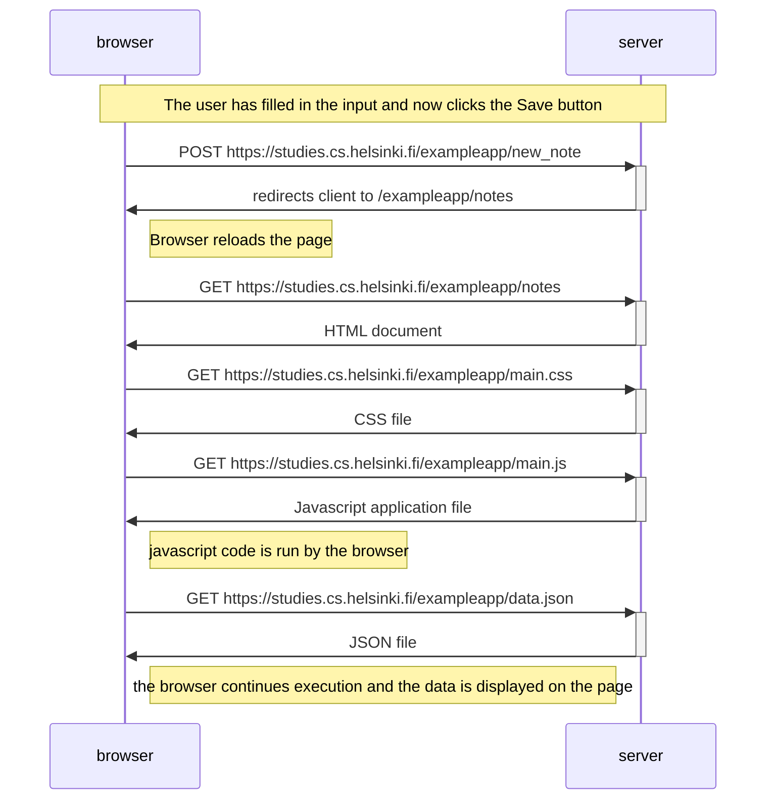

```mermaid
sequenceDiagram
    participant B as browser 
    participant S as server
    
    Note over B,S: The user has filled in the input and now clicks the Save button
    B->>+S: POST https://studies.cs.helsinki.fi/exampleapp/new_note
    S->>-B: redirects client to /exampleapp/notes
    Note right of B: Browser reloads the page
    B->>+S: GET https://studies.cs.helsinki.fi/exampleapp/notes
    S->>-B: HTML document
    B->>+S: GET https://studies.cs.helsinki.fi/exampleapp/main.css
    S->>-B: CSS file
    B->>+S: GET https://studies.cs.helsinki.fi/exampleapp/main.js
    S->>-B: Javascript application file
    Note right of B: javascript code is run by the browser
    B->>+S: GET https://studies.cs.helsinki.fi/exampleapp/data.json
    S->>-B: JSON file
    Note right of B: the browser continues execution and the data is displayed on the page

```