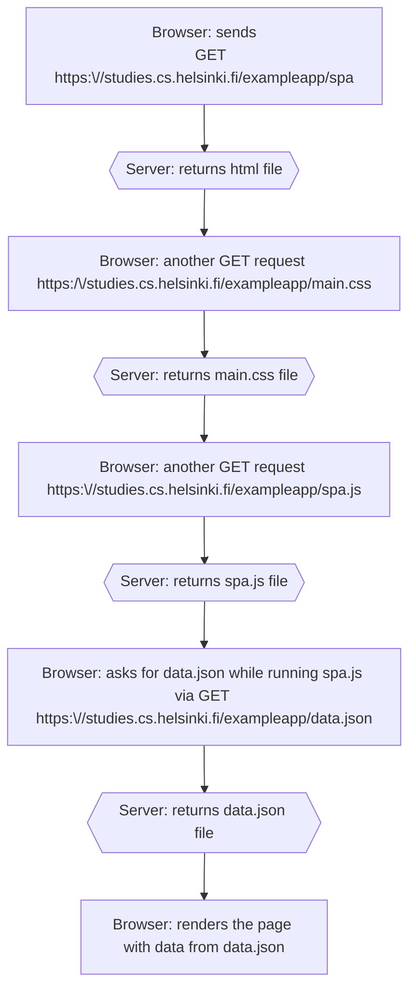

```mermaid
    graph TD
    A[Browser: sends
    GET https:\//studies.cs.helsinki.fi/exampleapp/spa
    ]-->
    B{{Server: returns html file}}-->
    C[Browser: another GET request https:/\/studies.cs.helsinki.fi/exampleapp/main.css]-->
    D{{Server: returns main.css file}}-->
    E[Browser: another GET request https:\//studies.cs.helsinki.fi/exampleapp/spa.js]-->
    F{{Server: returns spa.js file}}-->
    G[Browser: asks for data.json while running spa.js via GET https:\//studies.cs.helsinki.fi/exampleapp/data.json]-->
    H{{Server: returns data.json file}}-->
    I[Browser: renders the page with data from data.json]
```