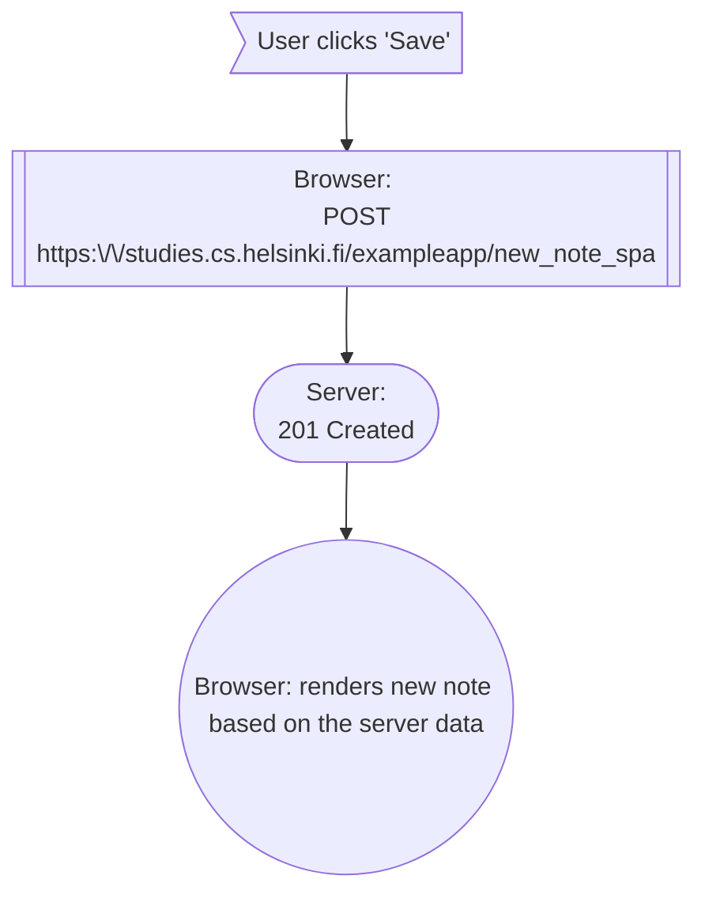

```mermaid
    flowchart TD
    A>User clicks 'Save']--> 
    B[["Browser: 
    POST https:\/\/studies.cs.helsinki.fi/exampleapp/new_note_spa"]]-->
    C(["Server:
    201 Created"])-->
    D(("Browser: renders new note based on the server data"))
```